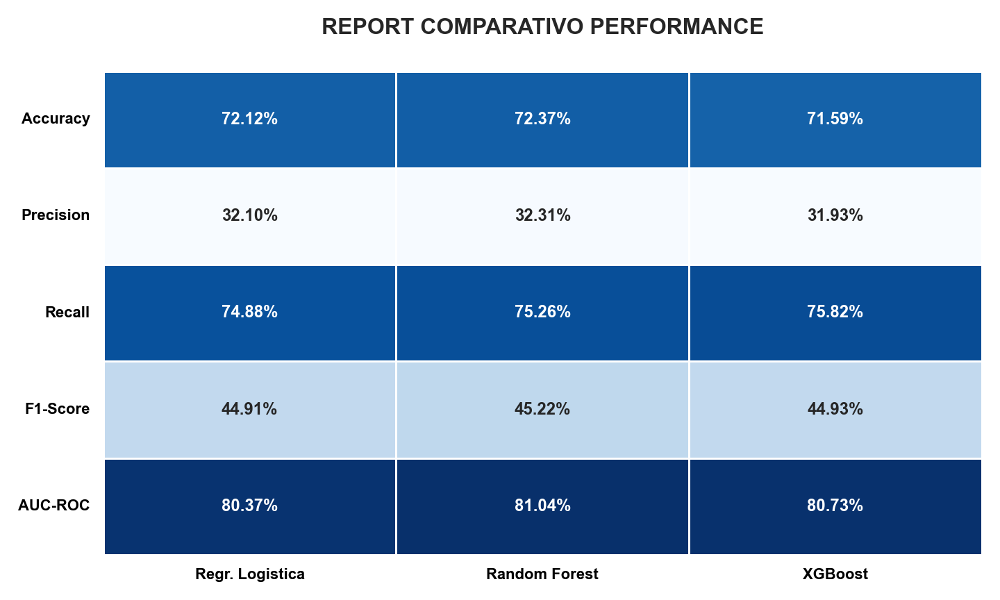
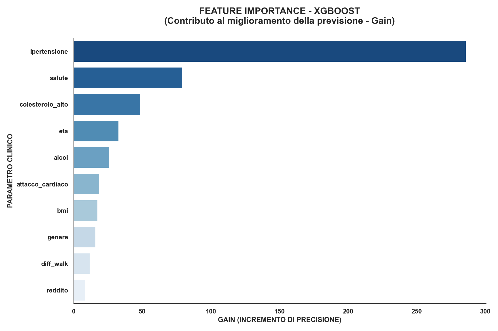
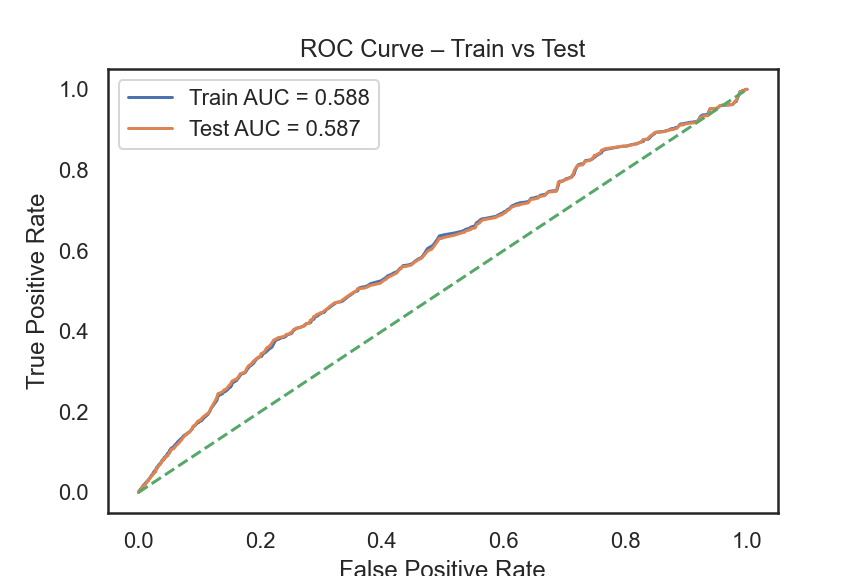

# 🩺 Diabetes Prediction: Pipeline Completa di Machine Learning

Questo progetto applica algoritmi avanzati di classificazione per prevedere il rischio di diabete. L'obiettivo principale è fornire uno strumento di supporto alla diagnosi che massimizzi la **Recall**, riducendo al minimo i falsi negativi in ambito clinico.

---

## 🚀 Il Flusso di Lavoro (Workflow)

Il progetto segue un approccio rigoroso di Data Science:

1.  **Analisi Esplorativa (EDA):** Studio della distribuzione del target e delle correlazioni.
2.  **Pre-processing & Scaling:** Suddivisione dei dati (Train/Test) e applicazione di `StandardScaler` evitando il *Data Leakage*.
3.  **Model Selection:** Confronto tra Regressione Logistica, Random Forest e XGBoost.
4.  **Validazione:** Controllo dell'overfitting tramite curve ROC.

---

## 📊 1. Analisi della Distribuzione
L'analisi iniziale mostra la prevalenza delle classi. Lo sbilanciamento del target ha guidato la scelta di ottimizzare la Recall invece della semplice Accuracy.

---

## ⚖️ 2. Selezione del Modello (Performance Report)
Il confronto ha rivelato che **XGBoost** offre la miglior **Recall (75.82%)**. In ambito medico, identificare correttamente un paziente malato (Vero Positivo) è prioritario rispetto alla precisione globale.

---

## 🔬 3. Interpretazione dei Fattori di Rischio
Attraverso la **Feature Importance** di XGBoost, abbiamo identificato i predittori clinici più significativi: **Ipertensione**, **BMI** e **Salute Generale** risultano i driver principali.

---

## 🛡️ 4. Validazione e Generalizzazione (No-Overfitting)
Il confronto tra le curve ROC del set di addestramento e di test conferma la stabilità del modello.

* **AUC-TRAIN:** 0.679
* **AUC-TEST:** 0.678
* **Conclusione:** La coerenza tra le curve dimostra l'assenza di overfitting e un'ottima capacità di generalizzazione su nuovi pazienti.

---

## 🛠️ Tecnologie Utilizzate
* **Linguaggio:** Python 3.x
* **Librerie Principali:** `pandas`, `scikit-learn`, `xgboost`, `seaborn`, `matplotlib`

## 📂 Come riprodurre il progetto
1.  Clona la repository.
2.  Installa le dipendenze: `pip install -r requirements.txt`.
3.  Esegui lo script: `python diabete.1.py`.

---
*Progetto realizzato per analisi di dati clinici e ottimizzazione di modelli predittivi.*
